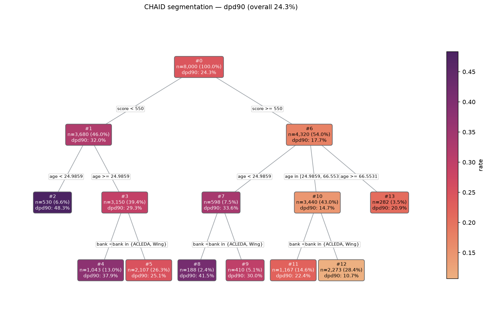

# CHAID Segmentation

A self-contained Python package for **population segmentation** using
[CHAID](https://en.wikipedia.org/wiki/CHAID) decision trees. You give it a
KPI/target and a set of predictors; it **auto-bins** the continuous predictors,
grows a CHAID tree, and hands back interpretable **segments** with an event rate
(or mean), population, population share and lift — plus a static tree chart where
each **node is a population** and each **branch is a choice**.

It is built for the workflow: *"input a KPI, generate a tree, read off the
high/low segments of the customer base."* For example, for a `90+DPD` target:

> **age < 25 AND region = Phnom Penh AND bank = ABA → 60% 90+DPD rate, 10% of population, 2.5x lift**

The CHAID tree engine is **bundled in this repository** — there is no external
`CHAID` dependency to install. It is based on the
[Rambatino/CHAID](https://github.com/Rambatino/CHAID) project (Apache 2.0); see
[Credits & License](#credits--license).

## Features

- **Automatic binning** of continuous predictors — supervised (target-based),
  equal-width, equal-frequency (quantile) or manual cut points, chosen per variable.
- **Binary and continuous KPIs** — node rate is the event rate `P(target = positive)`
  for a binary target, or the mean for a continuous target.
- **Interpretable segments** — every terminal node becomes a readable rule with
  rate, population, population share and lift.
- **Static visualisation** (matplotlib + seaborn) — node = population, branch =
  choice, colour = rate.
- **Predict / score** new data by re-applying the fitted bins and rules.
- **Load straight from CSV or Parquet** with one call.

## Installation

Requires **Python 3.9+**. Install from this repository:

```bash
pip install .                       # core (numpy, pandas, scipy, matplotlib, seaborn, ...)
pip install '.[segmenter-target]'   # + optbinning, for method="target" (supervised binning)
pip install '.[parquet]'            # + pyarrow, for ChaidSegmenter.from_parquet
```

`matplotlib` and `seaborn` are core dependencies (binning + plotting). `optbinning`
and `pyarrow` are only needed for target-based binning and Parquet loading
respectively, and are imported lazily with a clear error if missing.

## How to use

```python
import pandas as pd
from chaid_segmenter import ChaidSegmenter

df = pd.read_csv("loan_book.csv")     # columns: age, income, tenure, score, region, bank, dpd90

seg = ChaidSegmenter(
    target="dpd90",
    positive_class=1,                                    # binary event-rate target
    predictors={
        "age":    {"method": "target", "max_bins": 4},      # supervised (optbinning)
        "income": {"method": "equal_width", "bins": 4},     # fixed-interval bins
        "tenure": {"method": "equal_frequency", "bins": 4}, # quantile bins
        "score":  {"method": "manual", "edges": [550, 650, 750]},
        "region": {"method": "nominal"},                    # categorical, used as-is
        "bank":   {"method": "nominal"},
    },
    max_depth=3,
    min_child_node_size=0.02,         # int count, or a fraction of the dataset
    alpha_merge=0.05,
)
seg.fit(df)

seg.summary()                         # tidy DataFrame, highest rate first
seg.segments()                        # list[Segment]
seg.predict(df_new)                   # assign rows to terminal segments
seg.plot("tree.png")                  # static matplotlib/seaborn chart
```

Load and fit in a single call:

```python
seg = ChaidSegmenter.from_csv("loan_book.csv", "dpd90", predictors, positive_class=1)
seg = ChaidSegmenter.from_parquet("loan_book.parquet", "dpd90", predictors, positive_class=1)
```

A runnable, self-contained demo lives at
[`examples/dpd_segmentation.py`](examples/dpd_segmentation.py).

### You don't have to spell out every predictor

`predictors` accepts three forms — pick whichever is least effort:

```python
# 1. Full control: a spec (or method string) per column
predictors={"age": {"method": "target", "max_bins": 4}, "region": "nominal"}

# 2. Just the column names — the method is inferred from each column's dtype
#    (numeric -> default_numeric_method, non-numeric -> nominal)
predictors=["age", "income", "region", "bank"]

# 3. Omit it entirely — auto-select every column except the target/weight
ChaidSegmenter(target="dpd90", positive_class=1).fit(df)
```

In full-auto mode, constant columns and high-cardinality text columns (IDs, names,
free text — anything with more than `max_nominal_cardinality` distinct values) are
skipped automatically. You can always mix inference with overrides — e.g.
`{"age": "auto", "score": {"method": "manual", "edges": [550, 650]}}` — and inspect
what was chosen via `seg.resolved_predictors` after `fit`. Inferred numeric columns
use `default_numeric_method` (default `"target"`, falling back gracefully if you
prefer `"equal_frequency"`/`"equal_width"`).

## Expected output

### `seg.summary()`

A `pandas.DataFrame`, one row per terminal segment, highest rate first:

```
 node_id                                                           description population population_pct  rate  lift
       2                                         age < 24.9859 AND score < 550        530           6.6% 48.3% 1.99x
       8                         bank = ABA AND age < 24.9859 AND score >= 550        188           2.4% 41.5% 1.71x
       4                         bank = ABA AND age >= 24.9859 AND score < 550      1,043          13.0% 37.9% 1.56x
       9             bank in {ACLEDA, Wing} AND age < 24.9859 AND score >= 550        410           5.1% 30.0% 1.24x
       5             bank in {ACLEDA, Wing} AND age >= 24.9859 AND score < 550      2,107          26.3% 25.1% 1.03x
      11             bank = ABA AND age in [24.9859, 66.5531) AND score >= 550      1,167          14.6% 22.4% 0.92x
      13                                       age >= 66.5531 AND score >= 550        282           3.5% 20.9% 0.86x
      12 bank in {ACLEDA, Wing} AND age in [24.9859, 66.5531) AND score >= 550      2,273          28.4% 10.7% 0.44x
```

### `seg.segments()`

Each `Segment` is a small object you can read off directly:

```python
top = seg.segments()[0]
top.description     # 'age < 24.9859 AND score < 550'
top.rate            # 0.4830...   (48.3% 90+DPD rate)
top.population      # 530.0
top.population_pct  # 0.06625     (6.6% of the book)
top.lift            # 1.99        (vs the 24.3% overall rate)
top.node_id         # 2
top.rules           # [{'variable': 'age', 'label': 'age < 24.9859', 'data': [...]},
                    #  {'variable': 'score', 'label': 'score < 550', 'data': [...]}]
```

### `seg.plot("tree.png")`

Each node shows its population (count + % of total) and rate; each branch is
labelled with the choice that leads into it; node colour encodes the rate:



### `seg.predict(df, with_rate=True)`

Assigns every row to its terminal segment (and, optionally, that segment's rate):

```python
>>> seg.predict(df_new, with_rate=True).head()
   node_id      rate
0       11  0.223650
1        4  0.378715
2       12  0.106907
3        5  0.250593
4        4  0.378715
```

Rows that match no segment (e.g. an unseen category at predict time) come back as `<NA>`.

## Binning methods

Each predictor's `method` selects how it is turned into branches:

| `method` | Spec keys | Description |
|----------|-----------|-------------|
| `target` | `max_bins` | Supervised optimal binning via [optbinning](https://github.com/guillermo-navas-palencia/optbinning) — monotonic event rate. Needs the `segmenter-target` extra. |
| `equal_width` | `bins` | Fixed-width intervals across the value range. |
| `equal_frequency` | `bins` | Quantile bins of roughly equal population. |
| `manual` | `edges` | User-supplied interior cut points. |
| `nominal` | — | Categorical predictor, used as-is (no binning). |

Continuous predictors are converted to **ordinal bin codes**, so only contiguous
bins ever merge and every branch renders as a clean range (`age < 25`,
`in [25, 40)`, `>= 40`). Missing values become their own `missing` branch.

A spec may be written as a bare method string when it takes no options, e.g.
`"region": "nominal"`.

## Targets

- **Binary** — pass `positive_class` (the event value, e.g. `1`). Node `rate` is
  `P(target == positive_class)` and `lift` is `rate / overall_rate`.
- **Continuous** — omit `positive_class`. Node `rate` is the **mean** of the target
  and `lift` is `mean / overall_mean`.

## API reference

### `ChaidSegmenter(...)`

| Parameter | Default | Description |
|-----------|---------|-------------|
| `target` | — | Name of the KPI/target column. |
| `predictors` | `None` | A `{column: spec}` dict, a list of column names (methods inferred from dtype), or `None` for full auto-select. See [Binning methods](#binning-methods) and [above](#you-dont-have-to-spell-out-every-predictor). |
| `positive_class` | `None` | Event value for a binary target; `None` ⇒ continuous target. |
| `default_numeric_method` | `"target"` | Binning method for auto-inferred numeric predictors (`target` / `equal_frequency` / `equal_width`). |
| `default_bins` | `5` | Bin count for auto-inferred numeric predictors. |
| `max_nominal_cardinality` | `20` | In full-auto mode, non-numeric columns with more distinct values are skipped. |
| `max_depth` | `3` | Maximum tree depth. |
| `min_child_node_size` | `30` | Minimum observations per child. Values in `(0, 1)` are treated as fractions of the dataset. |
| `min_parent_node_size` | `None` | Minimum observations to split a node; defaults to `min_child_node_size`. Fractions supported. |
| `alpha_merge` | `0.05` | Significance threshold for merging predictor categories. |
| `split_threshold` | `0` | Surrogate-split threshold (passed through to the tree engine). |
| `max_splits` | `None` | Maximum number of children per split. |
| `weight` | `None` | Optional weight column; populations and rates use weighted sums. |

### Methods

- `fit(df)` — fit the binners and grow the tree from a `pandas.DataFrame`.
- `segments(sort_by_rate=True)` — list of `Segment` objects.
- `summary()` — segments as a tidy `DataFrame`.
- `segment_rates` — `{node_id: rate}` for the terminal nodes.
- `predict(df, with_rate=False)` — terminal `node_id` per row (optionally with rate).
- `plot(path=None, **kwargs)` — render the tree; returns the matplotlib figure and
  writes to `path` if given. Accepts `figsize`, `cmap`, `dpi`, font-size overrides.
- `ChaidSegmenter.from_csv(path, target, predictors, *, read_csv_kwargs=None, **kwargs)`
  and `from_parquet(...)` — load a file, construct and `fit` in one call.

### `Segment`

`node_id`, `description`, `rate`, `population`, `population_pct`, `lift`, and a
structured `rules` list of `{variable, label, data}`.

## How it works

`ChaidSegmenter` fits a `Binner` per continuous predictor and feeds the resulting
integer bin codes (as **ordinal** columns) plus the nominal predictors into a
bundled CHAID tree engine, which splits on the predictor most strongly associated
with the target (chi-squared for categorical targets, Bartlett's/Levene's test for
continuous targets). Because the bins enter as contiguous ordinal codes, merged
groups always describe a single, readable range. Terminal nodes are then translated
back into rate/population/lift segments.

### Low-level tree engine

The underlying CHAID tree implementation is bundled and importable as `CHAID`
(`from CHAID import Tree`) for advanced use — building a tree by hand, exporting
`classification_rules()`, treelib conversion, etc. The segmentation API above is the
recommended entry point for the KPI-segmentation workflow.

## Testing

```bash
pip install -e '.[segmenter-target,parquet,test]'
pytest tests/
```

## Credits & License

This project is built on top of [**CHAID**](https://github.com/Rambatino/CHAID)
by Mark Ramotowski, Richard Fitzgerald and contributors. The `CHAID/` package in
this repository is that upstream implementation, **bundled unmodified** as the
underlying tree engine. The `chaid_segmenter/` package — automatic binning, KPI
segmentation and the matplotlib/seaborn visualisation — is an original addition.

Distributed under the **Apache License 2.0**. See [LICENSE.txt](LICENSE.txt) for
the full license text and [NOTICE](NOTICE) for attribution.
